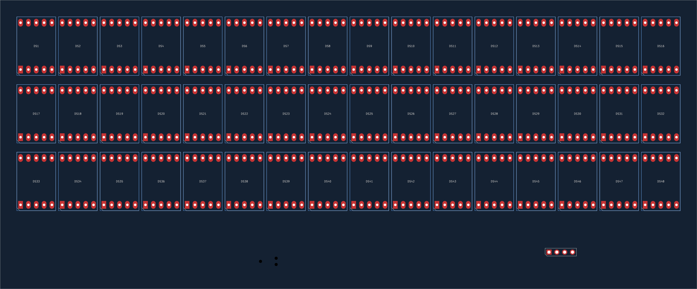
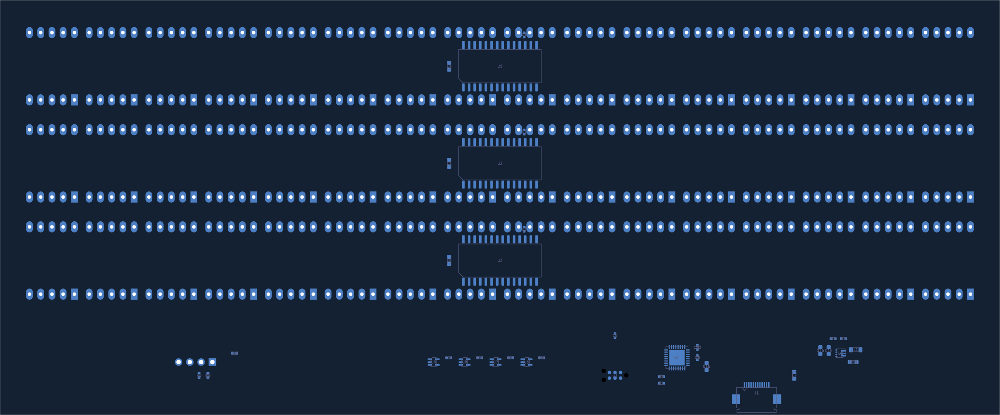

# Seven-segment PCB floor plan — 2026-10-02

`calcumaker-display.kicad_pcb` is the editable KiCad 10 source: **86 components,
13 groups, two copper layers**, with no routing. The provisional **226 × 94 mm**
outline runs from (50,50) to (276,144). This is wider than the 200.50 mm keyboard;
the two display alternatives do not yet share a qualified enclosure interface.



## Display and electronics

The 48 FJ5161AH digits form three rows of 16, at **13.50 mm horizontal / 22.00 mm
vertical pitch**. Front-view centers start at (61.75,65), increase left to right,
and use Y = 65, 87, 109 mm. DS1–16, DS17–32 and DS33–48 are the three rows.
The stock LTS6760 land is rotated 90°: pin 1 is lower left and DP lower right.
The [FJ5161AH package drawing, page 1](https://datasheet.lcsc.com/datasheet/pdf/98a0afa1031cc60ec3a90f34c2277d39.pdf)
specifies a 12.6 × 19 mm body, 15.24 mm pin-row separation and 2.54 mm pin pitch.
Its A/B/C/D/E/F/G/DP pins are 7/6/4/2/1/9/10/5; common cathodes are 3 and 8.
The expanded schematic assertions check this complete mapping for all 48 digits.

Each row is one group containing its digits, underside TM1640, 100 nF bypass,
10 µF bulk capacitor, body outlines and viewing-window reference. Drivers sit
centrally behind their rows, between the through-hole pin rows. Their bypasses
sit next to VDD without colliding with the digit lead pads.

The lower strip holds the underside electronics:

| Group | Placement intent |
|---|---|
| G031 U4 | C8 beside VDD/VSS, C11 local bulk, C12 beside reset; C9 near the debug/interface area and C10 near the optional OLED. |
| Boot / SWD | R4 isolates the host BOOT signal from PA14/SWCLK; J3 has an 11 × 8 mm probe-access drawing reservation. |
| Boost U5 | L1, C13, C14/C15 and feedback divider R2/R3 grouped at the lower left. Routing must minimize the switching/current loops and keep feedback away from SW. |
| Buffers U6–U9 | Each has its own nearby C16–C19; common CLK plus one DIN per TM1640. |
| FFC J1 | Faces the lower edge, with VSYS input bulk C7 nearby. |
| Optional OLED J2 | Front-side header at lower right; R5/R6 beneath it. All three default DNP. Module envelope remains open. |



Placements are unlocked and grouped for editing. All display bodies and the OLED
header are on the front; 37 other footprints are on the back. No mounting holes
have been chosen. The stock display 3D model is not proof of the selected body's
fit or standoff above the soldered electronics.

## Mechanical references

| Layer | Contents |
|---|---|
| User.1 / Display.Windows | Three **217 × 20 mm** viewing rectangles centered at (163,65), (163,87), (163,109). |
| User.2 / Display.Geometry | 48 nominal 12.6 × 19 mm package outlines. |
| User.3 / Mechanical.Notes | Row identities, dimensions and provisional status. |
| User.4 / Placement.Notes | Electronics labels and debug-access reservation. |
| Edge.Cuts | PCB perimeter only. |

The [reference SVG](mechanical/display-reference.svg) and
[window DXF](mechanical/viewing-windows.dxf) are **viewing references**, not
released bezel/plate cutting profiles. Material, wall thickness, optical clearance,
mounting and machining tolerances are not specified. DXF is 1:1 millimeters,
top view with Y upward (PCB X, −PCB Y); its 12 line segments make three closed
rectangles. The [center CSV](mechanical/display-positions.csv) records every digit.
Regenerate the DXF/SVG with `make -C hardware display-mechanical`; refresh the CSV
and previews when moving components. The native board remains authoritative.

## Schematic fixes and verification

The reusable row wiring is retained. The MCU now uses the corrected G031 package
symbol, explicit NCs, R4 = 1 kΩ boot isolation, and connected OLED signal names.
R5/R6 add optional 4.7 kΩ OLED pullups. External supply flags establish power
sources for ERC. Project root UUIDs were corrected so native KiCad saves preserve
repeated-sheet references; library shapes were refreshed without replacing BOM
fields. Dense global-label page lists are hidden for readable drawings.

The G031 BOOT0/PA14 input requires **HIGH** for boot selection with `nBOOT_SEL=0`;
the host must release it for SWD. The RP2040 matrix alternative instead requires
**LOW** on its isolated BOOTSEL branch. Firmware must select the correct behavior.

KiCad 10.0.6 checks: **zero ERC violations, zero DRC geometry/clearance findings,
zero courtyard overlaps and zero schematic-parity issues**. All electrical pad
nets match the expanded schematic. There are **584 unrouted connections**;
no tracks, routed vias or copper zones were added. Original design-rule limits
were preserved.

```sh
make -C hardware check-display-wiring
kicad-cli pcb drc --schematic-parity --format json -o /tmp/display-drc.json \
  hardware/calcumaker-display/calcumaker-display.kicad_pcb
```

Before routing/release: qualify the boost inductor current rating, capacitor
effective capacitance/DC bias, thermal/current budget and selected connector
footprints/contact orientation. U6–U9 now use the SOT-353 / SC-70-5 land required by the existing
74HCT1G125GW selection, replacing the draft SOT-23-5 assignment. The
[Nexperia datasheet](https://assets.nexperia.com/documents/data-sheet/74HC_HCT1G125.pdf)
confirms package and TTL inputs for the 5 V rail. Purchasing codes still need
normal BOM reconciliation before ordering. Enclosure mounting, soldered digit lead clearance, final
silkscreen, routing and ground returns remain unfinished.
