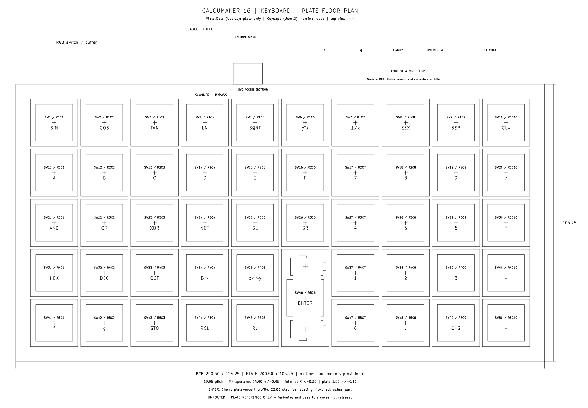

# Keyboard PCB and mechanical plate floor plan — 2026-10-02

The editable source is `calcumaker-keyboard.kicad_pcb`, a KiCad 10 board with all
227 schematic components placed. Its 61 groups include 49 complete key cells,
five electronics groups, five annunciators, and the PCB/plate envelopes.
Each key-cell group contains its switch, diode, RGB LED, bypass capacitor, plate
opening and keycap/reference drawing. Move the entire group to keep these aligned.
Placements are unlocked; routing and enclosure mounting remain to be designed.



## Physical key layout

- 5 × 10 matrix at **19.05 mm pitch**, with **49 switches**. Legends follow the
  16C base layout in `firmware/calcumaker-core/src/keys.rs` and `doc/keymap-16c.txt`.
- First switch SW1 is at **(64.525, 83.525) mm**. Columns increase in X and rows
  in Y when looking down at the keycaps. The key field occupies 190.50 × 95.25 mm.
- **SW36 is absent.** SW46 ENTER is wired to R5C6 but physically centered at
  **(159.775, 150.200) mm**, halfway between the two lowest row centers. Its diode,
  LED and capacitor follow that physical position. Its nominal cap envelope is
  18.00 × 37.05 mm; ordinary cap envelopes are 18.00 × 18.00 mm.
- [key-positions.csv](mechanical/key-positions.csv) records the 49 centers,
  logical matrix cells and associated component references for this revision.

The PCB's **200.50 × 124.25 mm outline** is provisional, from (50,50) to
(250.50,174.25). A top electronics strip keeps the scanner, interconnects and
annunciators away from the switch field. The separate plate covers only the
key field: **200.50 × 105.25 mm**, from (50,69) to (250.50,174.25). Its upper edge
leaves the top-side annunciators visible. Fastening holes and case interfaces are
intentionally awaiting enclosure dimensions; neither outline is a released part.

## Component placement

The hot-swap footprints are on **B.Cu**, as their authored geometry requires:
the Kailh sockets are underneath, with switch bodies and keycaps above the PCB.
Each reverse-mount SK6812MINI-E sits 5.08 mm north of its switch center, aligned
to the switch's LED window. The footprint's small LED aperture remains on PCB
Edge.Cuts. Its 100 nF capacitor is immediately beside VDD; each SOD-123 matrix
diode sits just south of its socket, with its cathode near the switch's pad 2.

There are **222 bottom-side footprints** and **five top-side annunciator LEDs**.
The five annunciator resistors are underneath, beside their LEDs. The scanner
and power electronics also occupy the underside, outside the key field:

| Group | Arrangement |
|---|---|
| Scanner U1 | C1 directly beside VDD/VSS, C2 nearby, C4 bulk nearby. C3 bypasses the incoming 3V3 interface rail. |
| Reset, boot, debug | C5 beside NRST; R6/R11 near the SWCLK/BOOT pin. J2 has an 11 × 8 mm drawing reservation for bottom-side probe access. |
| Interconnects | J3 FFC faces the top edge. J1 DF40 sits alongside as the population alternative; it is not a verified mating location for the MCU PCB. |
| RGB rail | Q1/Q2 and R7/R8/R10 form a compact switch/control group, with C7 nearby on VLED. |
| RGB data | U2/C6, series resistor R9 and pull-down R12 sit toward the first pixel, SW1/D56. |
| Annunciators | f, g, CARRY, OVERFLOW and LOWBAT run along the uncovered top strip. |

Pad-center distances are **1.787 mm for every LED VDD-to-bypass connection**,
**2.175 mm from C1 to U1 VDD**, and **2.342 mm from C6 to U2 VCC**. These are
placement distances, not routed lengths. Add close ground returns when routing.
The existing RGB chain runs left-to-right within each logical row, then returns
to the next row's left end; reserve a row-margin route for those longer returns.
Row4 bypasses the omitted key and ENTER remains in Row5's chain.

## Mechanical drawing layers

| KiCad layer | Display name | Contents |
|---|---|---|
| User.1 | **Plate.Cuts** | Plate perimeter, 48 nominal 14 × 14 mm MX cutouts, and one combined vertical ENTER switch/stabilizer profile. Closed cutting contours only. |
| User.2 | **Keycaps** | Nominal cap envelopes and base legends. These are reference geometry, not cutting paths. |
| User.3 | **Plate.Notes** | Switch centers/references, ENTER stabilizer centers, overall sizes, tolerances and provisional status. |
| User.4 | **Placement.Notes** | Electronics groups, annunciator labels and SWD access reservation. |
| Edge.Cuts | PCB edge | PCB outline and 49 reverse-LED apertures. **The large switch-plate openings are not PCB cutouts.** |

The nominal plate geometry uses the Cherry MX/plate-mount stabilizer drawings in
the [Cherry switch catalogue (2010), printed pages 70–71](https://telcontar.net/KBK/Cherry/docs/Cherry%20switch%20catalogue%20%282010%29.pdf).
The drawing specifies 14.00 ±0.05 mm MX openings, internal corner radius no more
than 0.30 mm and nominal plate thickness 1.50 ±0.10 mm. ENTER uses 23.80 mm
stabilizer stem spacing, with the horizontal Cherry 1×2 profile rotated 90°.
Its connected opening bounds are 14.97 × 32.20 mm. Confirm the selected
plate-mount stabilizer and actual switch fit, process kerf and plate material
before manufacturing. No PCB-mount stabilizer holes were added.

The [plate DXF](mechanical/keyboard-plate.dxf) is 1:1 in millimeters, top-view
orientation. KiCad exports DXF Y upward, so its coordinates are (PCB X, −PCB Y).
It contains **232 line segments forming 50 closed, non-branching contours**:
the perimeter, 48 square openings and the ENTER opening. It contains no text,
keycap outlines or PCB drill holes. The
[annotated SVG](mechanical/keyboard-plate-reference.svg) is for review.

Regenerate both from the board after editing:

```sh
make -C hardware keyboard-plate
```

The export target explicitly disables PCB drill marks. Refresh the center CSV
and PNG previews if key positions change; the native board remains authoritative.

## Verification and remaining work

Checked with KiCad 10.0.6:

- All 227 component references and every electrical pad net match the expanded
  schematic. The omitted SW36/D36/D91/C136 remain absent.
- All 49 key-cell offsets, assembly sides and plate group associations verified.
- Plate DXF units, closure, contour count and opening dimensions verified.
- **0 DRC geometry/clearance violations, 0 courtyard overlaps, 0 schematic-parity
  issues** under the original project rules, which were preserved unchanged.
- **471 unrouted connections** remain. No tracks, routed vias or copper zones
  have been added; this is a placement pass.
- `make -C hardware check-wiring` validates the full key matrix, RGB chain,
  connector contract and MCU/power/debug nets. Keyboard ERC has no violations.

Still required: routing and ground returns; connector/cable contact verification;
enclosure mounting and bottom socket clearance; actual stabilizer/keycap/LED-window
fit; final silkscreen and assembly access. Some 3D models are incomplete, so the
renders do not establish mechanical fit. J1/J3's six mechanical pads intentionally
have no signal net. The VSYS/RGB voltage and logic-level qualification work in
[WIRING_REVIEW.md](../WIRING_REVIEW.md) remains applicable.

```sh
make -C hardware check-wiring
kicad-cli pcb drc --schematic-parity --format json \
  -o /tmp/calcumaker-keyboard-drc.json \
  hardware/calcumaker-keyboard/calcumaker-keyboard.kicad_pcb
```
