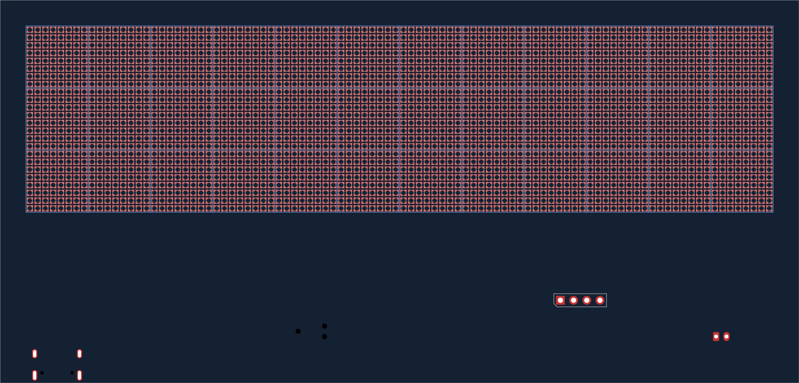
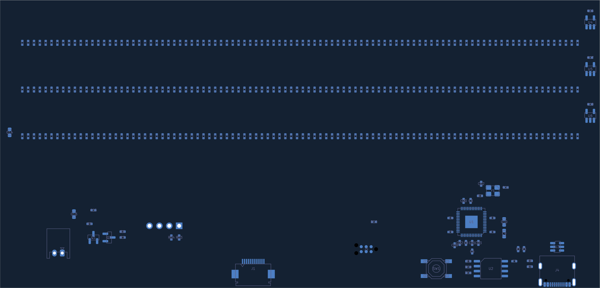

# Single-pixel PCB floor plan — 2026-10-02

`calcumaker-matrix.kicad_pcb` is the editable KiCad 10 source: **2,644 components,
48 groups, four copper layers**, with no routing. The provisional **154 × 74 mm**
outline runs from (50,50) to (204,124). The 96 × 24 pixel field uses **1.50 mm
pitch**, starting at front-view center (55.75,55.75). These dimensions are not a
qualified common enclosure interface with the seven-segment alternative.



## Pixels and local bypasses

Three independent 768-pixel chains each occupy an eight-row band. Each band has
12 groups, each containing 64 LEDs, eight underside 100 nF capacitors and its
12 × 12 mm drawing boundary. Each capacitor serves one column of eight LEDs;
there are **288 distributed bypasses** in addition to controller/buffer bypasses
and bulk capacitors. Plane impedance and transient tests must establish whether
this density is sufficient; it is not a measured power-integrity result.

Within each cluster, data snakes **down the first column, up the second**, and so
on. Even local columns rotate footprints 180°; odd columns use 0°. DOUT of the
last pixel in a cluster is one pitch from the next cluster's DIN. Every electrical
chain link is checked, including all 36 hierarchical instances. Chain 1 is
D1–D768, chain 2 D769–D1536, chain 3 D1537–D2304.

The [position CSV](mechanical/display-positions.csv) records reference, chain
(1-based), index within the chain (0-based), physical column/row (0-based), center
and rotation for all 2,304 pixels. Firmware's physical mapper is still TODO; use
this CSV when implementing it. The rendered 8×8 schematic is an electrical
sequence, while the PCB uses this column-serpentine physical arrangement.

The authored LED footprint was corrected against the
[XINGLIGHT XL-1010RGBC-2812B-S drawing, page 11](https://datasheet.lcsc.com/datasheet/pdf/c4679399b20041dfc677f105e35c9113.pdf).
At footprint angle 0°, top view has DOUT upper left, VDD upper right, GND lower
left and DIN lower right. The 0.45 mm square pads have centers at ±0.425 mm.
**Footprint numbers follow the SK6812 schematic symbol**, not XINGLIGHT package
numbers: 1=GND, 2=DIN, 3=VDD, 4=DOUT. See [library attribution](../lib/ATTRIBUTIONS.md).
There is no trusted LED 3D model; the footprint and manufacturer drawing govern.

## Controller and power placement

The LEDs and optional OLED header are on the front (2,305 footprints); the other
339 footprints are on the back. The lower strip holds the controller, USB, flash,
debug and power groups. Three data buffers sit by the leftmost pixel of each band.

| Group | Placement intent |
|---|---|
| RP2040 U1 | C1–C6 for six IOVDD pins; C19 1 µF at VREG_IN and C8 1 µF at VREG_OUT; C20/C21 100 nF on DVDD; C22 ADC_AVDD and C23 USB_VDD. C9/C10 bulk nearby. |
| QSPI U2 | Below U1, with local C7 and CS pullup R4. BOOTSEL SW1 and isolated 1 kΩ branches R10/R11 are alongside. |
| Crystal Y1 | Above U1, away from LED-power switching; C11/C12 and damping R1 nearby. The four-pad 3225 footprint is a candidate awaiting final crystal selection. |
| USB J4 | At the lower-left edge with ESD U3 nearby, separate 5.1 kΩ CC resistors and 27 Ω data resistors toward U1. |
| Debug J5 | Accessible lower strip with an 11 × 8 mm drawing reservation; R12 pulls RUN high. |
| FFC J1 | Faces lower edge; carries the unified host control interface. |
| LED power J2 / Q1 / Q2 | Lower-right inlet and compact switch/gate group; C13/C15 nearby and C14 at the far end of the pixel field. |
| U4–U6 | One buffer and local bypass at each chain input. |



Supply/crystal/boot treatment follows the
[official RP2040 hardware design guide](https://datasheets.raspberrypi.com/rp2040/hardware-design-with-rp2040.pdf).
Keep short supply and ground returns during routing. Four layers are enabled;
actual stackup thicknesses, copper weight and power-plane allocation remain to
be engineered. Placements are unlocked and no mounting holes have been chosen.

## Mechanical references

User.1 **Display.Windows** has a **145 × 37 mm** viewing rectangle centered at
(127,73). User.2 **Display.Geometry** has 36 cluster boundaries; User.3
**Mechanical.Notes** records pitch, dimensions and limitations. User.4
**Placement.Notes** labels the electronics and SWD-access reservation. Edge.Cuts
contains only the PCB perimeter.

The [reference SVG](mechanical/display-reference.svg) and
[window DXF](mechanical/viewing-windows.dxf) are viewing references, not released
bezel/plate cutting profiles. The DXF contains four line segments making one
closed rectangle, at 1:1 millimeters, top view with Y upward (PCB X, −PCB Y).
Regenerate them with `make -C hardware display-mechanical`; refresh the CSV and
previews if placements change. Diffuser spacing, optical bleed, wall thickness,
mounting and process tolerance remain open.

## Electrical corrections and limits

The original LED-cluster power stubs accidentally joined VLED and GND. Their
spacing and wires are corrected and all 2,304 supply pairs are checked as distinct.
The schematic now includes the 288 bypasses, completed RP2040 decoupling, USB-C
CC resistors, both USB D+/D− connector contacts, ESD channel connections, SWD,
RUN pullup, isolated BOOTSEL paths and optional OLED pullups. USB requires main
board 3V3: VBUS serves the ESD clamp and does not power the RP2040.

`DISP_BOOT` on this board is **active LOW**, isolated from QSPI_CS through R11;
the host must release it during normal flash operation. This differs from the
STM32 seven-segment alternative's active-HIGH BOOT0. Firmware support remains.
J3/R13/R14 for the OLED default DNP. Project root UUIDs were repaired so KiCad
preserves repeated-sheet annotations on native save.

**The LED power path is not qualified for fabrication.** J2 feeds `LED_VSYS`,
separate from the signal FFC's `VSYS` copper. Q1 switches it to VLED; grounds are
common. This separation prevents LED current from taking a parallel PCB path
through J1, but it does not increase the power source or connector rating.

- The XINGLIGHT electrical table specifies 3.5–5.5 V, while its feature list says
  4.5–5.5 V. Raw one-cell VSYS operation is therefore not established over the
  battery range. Resolve the discrepancy and supply strategy before release.
- At the datasheet's nominal 5 mA per color, all-white demand is **34.56 A** for
  2,304 pixels, plus roughly **0.81 A** using its 0.35 mA typical static current.
  These are estimates, not measured maxima. The existing JST-PH inlet, switch,
  host power source and unengineered copper cannot be treated as supporting this.
  Establish a hard current/brightness budget and redesign the feed as needed.
- U4–U6 use LVC buffers powered by VLED; confirm their VIH against RP2040 3V3
  output over the selected supply range, or choose suitable translation.
- Select the actual 12 MHz crystal/CL and capacitor values; qualify bulk capacitor
  DC bias, LED assembly tolerances, thermal behavior and all connector footprints.

## Verification

KiCad 10.0.6 reports **zero schematic-parity issues**, no courtyard overlaps,
and four geometry findings, all within the inherited J4 USB-C footprint: **hole
clearance 0.1944 mm versus the project minimum 0.25 mm**. The original rule is
preserved. Choose/validate the connector footprint and fabrication capability;
no exclusions or relaxed rules were added to hide these findings.

ERC has **zero errors and four reviewed warnings** about intentionally unused
chain-end labels (CH1_END/CH2_END/CH3_END and the reusable DOUT). The net checker
accepts only those exact label identities; other ERC findings fail. All electrical
PCB pad nets match the expanded schematic. There are **7,637 unrouted connections**;
no tracks, routed vias or copper zones were added.

```sh
make -C hardware check-display-wiring
kicad-cli pcb drc --schematic-parity --format json -o /tmp/matrix-drc.json \
  hardware/calcumaker-matrix/calcumaker-matrix.kicad_pcb
```
