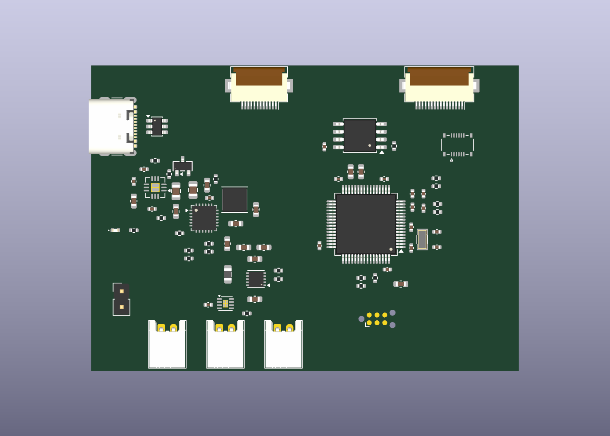

# MCU PCB floor plan — 2026-10-02

`calcumaker-mcu.kicad_pcb` is the editable KiCad 10 placement source. All 75
schematic components are imported with their original symbol links and pad nets,
placed on the front, and organized into 14 named KiCad groups. Enter a group in
the PCB editor to adjust its individual components.

The **70 × 50 mm rectangular outline is provisional**, from (100,100) to
(170,150) mm. It assumes the recommended **cabled keyboard** build in DESIGN.md.
Connector locations, enclosure fastening and the layer stack still need mechanical
agreement. No mounting holes were invented. J5 remains a population alternative;
its location is not a verified mating location for the keyboard PCB.

This is an **unrouted floor plan**: no tracks, vias or copper zones have been
added. Footprint-integrated thermal holes are present. Reference labels are on
F.Fab for placement review; final silkscreen is a later pass. User.Drawings carries
functional labels, the provisional-outline notice, the L1 reserve and probe area.



## Arrangement

| Region | Placement intent |
|---|---|
| Left edge | J1 USB-C faces outward; U3 sits immediately behind its data pads, with a clear route toward the MCU's west-side USB pins. |
| Upper left / middle left | U5, Q1, CC caps and OVP divider form the USB protection group. Protected VBUS then feeds the adjacent U4 charger group. |
| Charger | C2 is beside PMID, C27 beside BTST/SW, and L2 beside SW. C8/C9 occupy the output side; C10 is beside BAT. C11 and the control/NTC resistors remain nearby. |
| Lower left | Battery J2, pack NTC J8 and auxiliary VSYS J7 face the bottom edge. J9 provides accessible ship-mode wake; U6/C32 sit near the battery connection. D2/R5 form a separate indicator group. |
| Lower middle | U2 has C3 on its VIN side and C4/C5/C7 on VOUT. L1 sits on the switching-pin side, while R18/R19 are on the opposite configuration-pin side. |
| Center right | U1 is rotated 180° so USB faces the port and QSPI faces U7 above it. Local bypass caps surround the package. C22/C23 sit directly north of VCAP. |
| Quiet east side | Y1/C24/C25 are next to PC14/PC15, away from the two power inductors. ADC dividers and C33 occupy the adjacent quiet area. Keep switching copper and unrelated traces out of the crystal region. |
| Top edge | J3 display and J6 keyboard FFC connectors face outward, with clear cable insertion space. J5 sits below J6 as an optional stack connector. R13/R14 sit near the MCU's I2C pins. |
| Lower right | J4 has an 11 × 8 mm drawing reservation for probe access; C21 and R8 remain near their MCU pins. Confirm the actual Tag-Connect cable envelope and enclosure access. |

The groups separate USB data, USB power protection, charger, indicator, pack
connectors, gauge, 3V3 conversion, MCU supplies, crystal, reset/debug, ADC sensing,
QSPI, keyboard interfaces and display/auxiliary power. Every footprint belongs
to exactly one group. Placements remain unlocked for interactive refinement.

## Local capacitor placement

Distances below are **pad-center straight-line distances**, not routed lengths or
loop inductance claims. Route each capacitor to its supply pin before the bulk
rail, and provide a close ground return. Do not daisy-chain the bypass grounds.

| Capacitor | Nearby device pad | Distance |
|---|---|---:|
| C12 | U1.13 | 2.18 mm |
| C13 | U1.19 | 1.74 mm |
| C14 | U1.32 | 2.12 mm |
| C15 | U1.1 (VBAT on 3V3) | 1.84 mm |
| C16 | U1.64 | 1.74 mm |
| C20 | U1.48 | 1.94 mm |
| C22 / C23 | U1.30 VCAP | 2.16 / 2.90 mm |
| C26 | U7.8 flash supply | 2.24 mm |
| C32 | U6.3 gauge supply | 1.33 mm |
| C2 | U4.23 PMID | 1.99 mm |
| C27 | U4.21 bootstrap | 1.35 mm |
| C3 / C4 | U2.10 VIN / U2.6 VOUT | 2.31 / 2.31 mm |

C18/C19 supplement the U1.13 analog-supply bypass; C17 provides nearby bulk
decoupling. C33 is in the ADC divider cluster, 4.68 mm from U1.9. L2's input pad
is 2.48 mm from U4.19. Preserve short, wide power paths and compact ground returns
when routing; review the full power loops and exposed-pad grounding then.

## Verification and open items

Verified using KiCad 10.0.6, native schematic-to-PCB import, pcbnew geometry
inspection, 2D/3D rendering, schematic-parity DRC, and `make -C hardware check-wiring`:

- 75 footprints, 14 groups, all footprint courtyards present.
- **0 schematic-parity issues**, **0 courtyard overlaps**, **0 inter-component
  copper-clearance/shorting violations**, and **0 silk/mask clashes**.
- **241 unrouted connections** remain, as expected for this placement pass.
- **15 fabrication-rule violations remain visible**: four USB J1 pad-to-locator
  hole clearance reports (0.1944 mm versus the existing 0.25 mm rule), and eleven
  integrated thermal-hole reports on U4/U5 (0.20 mm versus the existing 0.30 mm
  minimum). These are footprint/process decisions; no rules or exclusions were
  changed to hide them.
- MCU/keypad electrical assertions pass; ERC remains 0 errors with the one
  previously reviewed MCU TCPP supply-model warning.

Before routing, select the actual L1 and confirm its saturation current, pad
geometry and thermal performance. Its existing 0805 footprint is a placeholder;
a **5 × 5 mm reserve** is drawn around it for a suitable replacement. Verify L2
current rating and every power capacitor's voltage/bias derating as well.

The assigned FFC, DF40 and USB lands still require comparison against the ordered
parts and cable contact orientation. FFC/DF40 mechanical mounting pads intentionally
have no signal net (eight native import warnings). Some parts lack complete 3D
models, so the render is not a full mechanical clearance check. Resolve the
USB locator/thermal-hole manufacturing rules, final mounting/stack height, plane
strategy, thermal relief/vias, USB impedance and power widths before fabrication.
The outstanding electrical qualification items in [WIRING_REVIEW.md](../WIRING_REVIEW.md)
still apply.

To rerun the connectivity and layout review from the repository root:

```sh
make -C hardware check-wiring
kicad-cli pcb drc --schematic-parity --format json \
  -o /tmp/calcumaker-mcu-drc.json \
  hardware/calcumaker-mcu/calcumaker-mcu.kicad_pcb
```

Placement follows the compact power-loop guidance in the
[BQ25601 datasheet, section 12](https://www.ti.com/lit/ds/symlink/bq25601.pdf)
and the input/output capacitor priority in the
[TPS63900 datasheet, section 10](https://www.ti.com/lit/ds/symlink/tps63900.pdf).
